<!-- above is the PAGE title and subtitle -->

  <h1 class="ar-title">THE AI ART DEBATE</h1>

  
Survey Finds Most People Are Fine with AI Art, Within Limits

  
The role of generative AI in creative work has become an increasingly heated debate as advanced AI tools have gone from research curiosities to everyday utilities. The existing discourse tends to be incredibly polarized, especially among those who were already making art before the launch of consumer-ready AI, who were working through techniques that required no generative model at all.

  
McDonald’s faced a rare public outcry after running AI-generated holiday art in a marketing campaign, forcing a swift retreat. A reality dating show called Fruit AI Love Island recently went viral, before SORA’s shutdown spelled its (timely) end.  Meanwhile, Merriam-Webster crowned “slop” as its 2026 Word of the Year, defined in part as “low-effort, low-quality AI-generated content flooding public feeds.” It’s naive to think this deluge of AI-generated content doesn’t impact us, because it's everywhere from news to social media and marketing, spilling into every area of our lives. 

  
Central to this conversation is the human cost: the artists, illustrators, and writers whose work is being displaced by AI-generated content. So where do people actually draw the line on AI-generated art?

<a href="#section-where" class="card">
Context of Application
</a>
<a href="#section-who" class="card">
Personal Use & Acceptance
</a>
<a href="#section-line" class="card">
How much AI is too much?
</a>
<a href="#section-perceptions" class="card">
Comparing Opinions
</a>
<a href="#section-nobody" class="card">
Responses and Actions Taken
</a>

<!-- end normal html section  --> 
<!-- everything in {} needs cr- prefix -->
 
<!--- quarto section 
':::{.cr-quartoSectionName}

  this text is in the left column, connected to an image using a link @cr-LINKNAME 

  !-- implied closed div --

  img container to link to 
  :::{#cr-LINKNAME} 

  this is the image sticky 
  

  !-- close img 
  :::

!-- close section --
:::

-->

<!-- 

 

sticky image (in right col)

:::{#cr-name}

:::
 --> 

<!-- Q2conditionall acceptacne --> 
:::{.cr-section}

**Despite the intensity of public discourse around AI in creative spaces,** outright rejection of AI-generated art remains a minority position among U.S. adults. Data from a January 2026 survey conducted via Prolific reveals that most respondents take a more nuanced stance of conditional acceptance. @cr-Q2

In other words, there is a pervasive willingness to engage with AI-generated content, provided its use remains bound by certain constraints. The AI Art discourse is not a question over whether it belongs in creative work anymore: instead its a broader conversation about the terms under which it does. @cr-Q2

:::{#cr-Q2}
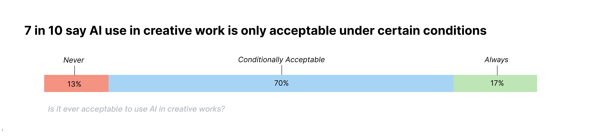
:::

:::

:::{.cr-section}
**Those willing to accept AI strongly agree that acceptability depends on context and extent of use,** which signals that the 'conditional' majority is not simply a neutral middle ground between rejection and wholesale acceptance. For this group, the legitimacy of AI use is judged on a case-by-case basis, and shaped by the specific circumstances of its application.  @cr-Q3

:::{#cr-Q3}
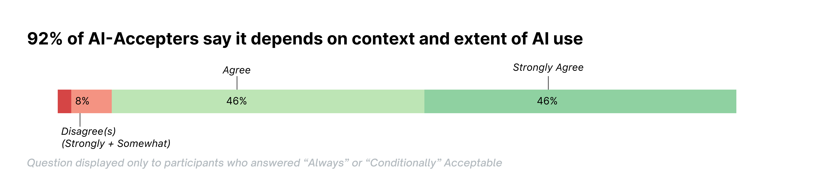
:::

:::

<!-- WHAT DO PEOPLE THINK OF AI -->

<!-- disclosure condtition number one as in the best one --> 
:::{.cr-section}

**Everyone strongly agrees that AI use should always be disclosed.** @cr-Q7

People want transparency--about the creative process or for the sake of honest attribution of labor. Even when no one is explicitly lying, failiong to disclose AI use can function at times like plaigarism. There are myriad reasons to want to know what one is 'consuming' online: an ethical objection motivating avoidance, for instance, or simply a perference for "real" material. There is no other norm more agreed upon than disclosure.  @cr-Q7

:::{#cr-Q7}
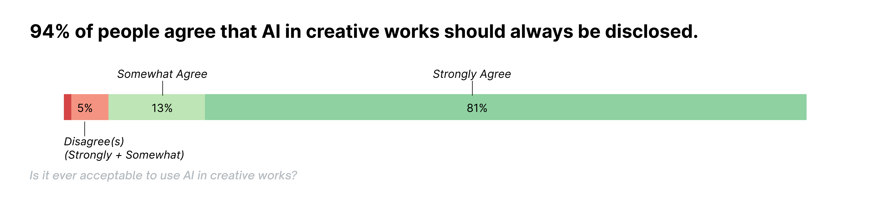
:::

:::
<!-- close-->

<!--Q6 is the one which was accidentally left unrequired and got like sub 200 participants so this may be cut from final version, Idk how to phrase it to make it clear that the count of respondents changed dramatically for only this question

:::{.cr-section}

  This is echoed in how respondents defined acceptable use in a select all question (this is them picking from provided options framing) more broadly. @cr-Q6

  When asked to identify conditions under which AI use is acceptable, clear disclosure was selected most frequently @- 1 
  
  followed by ethically sourced training data, @ 2
  
and significant human editing of the AI output. @cr-Q6 3 

  The conditions selected by respondents point to AI use being committed to transparency, consent, and a limit to what can be wholly-generated. @cr-Q6

  :::{#cr-Q6}
    
  :::

:::

--.

<!-- WHAT DOES CONDITIONALLY ACCEPTABLE MEAN?? -->

  <h2 class="section-header" >What is 'conditional' acceptance?</h2>
  
Acceptance rates shift depending on the context, such as the medium of work and the stage of creation where AI was utilized. Those accepting of AI have different tolerances for what is acceptable in a rough draft as opposed to what they'll accept in a finished piece.

:::{.cr-section}

**Across Mediums** @cr-mediums

**Digital art and writing received the highest acceptance rates.** They are also the domains where the earliest generative AI tools first became widely available and heavily marketed. [@cr-mediums]{pan-to="20%,0%" scale-by="1.5"}

**None of the other mediums break 50% acceptance.** [@cr-mediums]{pan-to="20%,-20%" scale-by="2"}

It's possible that, aside from being newer mediums to AI, the trailing four have always required some tether to reality. A fake photo or video required actors, animations, or an artistic construction. Voices, too, have always belonged to real people, unless it was the musically-adjacent process of creating a vocal synth. @cr-mediums

Illustration and writing, by contrast, have always had a potential to be wholly fictious.It's possible that respondents are responding to this difference, though the survey did not test this directly. @cr-mediums

:::{#cr-mediums}
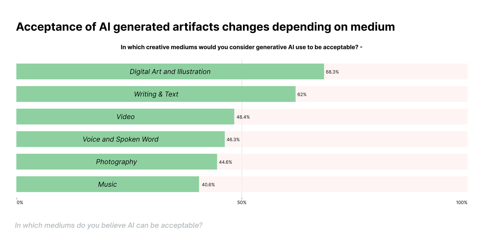
:::

:::

<!--  STAGES × MEDIUMS MATRIX           -->

:::{.cr-section}

**Acceptance rates as seen across different mediums** @cr-Matrix

Just as people often qualify AI as "only" a brainstorming aid, or "just" an editing tool, this matrix shows that the highest rates of acceptance are in early stages of production: **ideation,**  [@cr-Matrix]{pan-to="80%,0%" scale-by="2"}

**early drafting,** [@cr-Matrix]{pan-to="50%,0%" scale-by="2"}

**and editing.** [@cr-Matrix]{pan-to="0%,0%" scale-by="2"}

These are all stages where AI is an assistant rather than replacement. @cr-Matrix

Approval of whole-piece generation drops dramatically relative to earlier stages: it is the largest gap on the matrix for every medium.  @cr-Matrix

The closer AI moves to producing the final work, the less acceptable it becomes. What this suggests is that when most respondents rate something as acceptable for AI, what they have in mind is AI-assisted work, not AI-generated work. @cr-Matrix

Core generation is treated differently between mediums, as well: In writing, video, and voice, it is rejected outright. [@cr-Matrix]{pan-to="-75%,0%" scale-by="3.5"}

In other mediums, it is tolerated only marginally. [@cr-Matrix]{pan-to="-50%,0%" scale-by="2"}

Notably, all three mediums with non-zero approval for core generation have established histories and examples of algorithmic production and editing, which may explain why some respondents extend tolerance further than they do for writing, video, or voice. [@cr-Matrix]{pan-to="-50%,0%" scale-by="2"}

:::{#cr-Matrix}
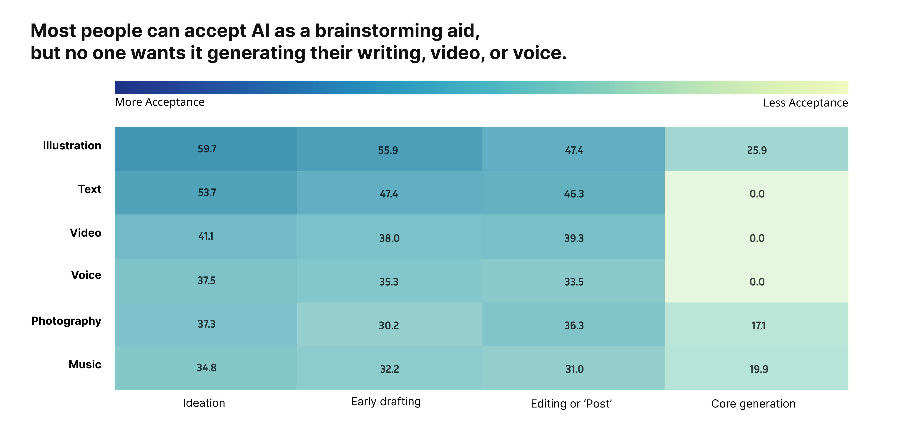
:::

:::

  <h2 class="section-header">Who's Making the Rules?</h2>
  
 Opinions on AI Art changes depending on who you ask. Creators, non-creators, and AI users each draw the line in a different place, aligning with popular decriptions of the AI discourse.

<!---ACCEPTANCE OF MEDIUMS BY PRACTIONER IN THAT MEDIUM -->
<!-- proximity to the creative process makes you more less sensitive to ai in that medium --> 
:::{.cr-section}

**Over half (55%) of respondents have used AI to produce a creative work, even if only experimentally. They have the highest rates of acceptance across all mediums.** @cr-creatortype

This isnt suprising, however it is notable that the non-AI-using creators and people who dont do create at all respond similarly across all mediums. [@cr-creatortype]{pan-to="50%,0%" scale-by="2"}

Non-AI-using creators and non-creators, despite their very different relationships to creative work display similar rates of acceptance across mediums. [@cr-creatortype]{pan-to="-50%,0%" scale-by="2"}

They both show acceptance rates that look more similar to each other than either does to the AI-user group. Seen deliniated across these three groups, it is clear that being a creator oneself without AI tools does not produce additional skepticism toward AI use within ones medium of creative practice. @cr-creatortype

That is to say: of Illustrators, writers, Photographers and musicians who don't use AI: none are particularly more opposed to AI in their fields than people who have never worked in those fields at all. @cr-creatortype

:::{#cr-creatortype}
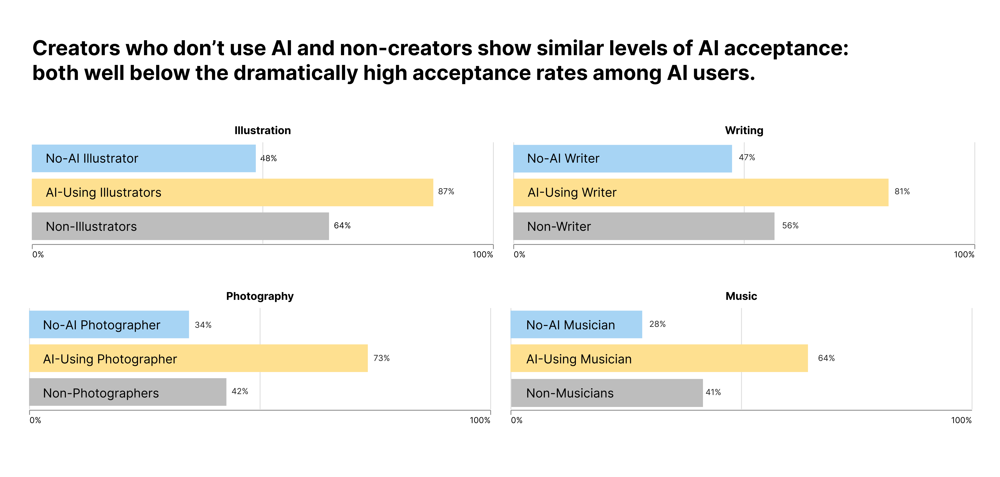
:::

:::

  <h2 class="section-header" >Says Who?</h2>
  
Even among people who use AI, there's a point where a work stops feeling human. The threshold is lower than you might think.

<!--close section -->
<!-- someting here to transition and talk about how now we are exploring how these two groups differ on perception and values of art and AI artifacts --> 

<!-- HISTOGRAMMIES HISTOGRAMMIE HISTOGRAMMIES HISTOGRAMMIES--> 
:::{.cr-section}

**CONDITIONS FOR ACCEPTABLE USE: HOW MUCH OF WORK CAN BE AI GENERATED? ** @cr-q5one

:::{#cr-q5one}
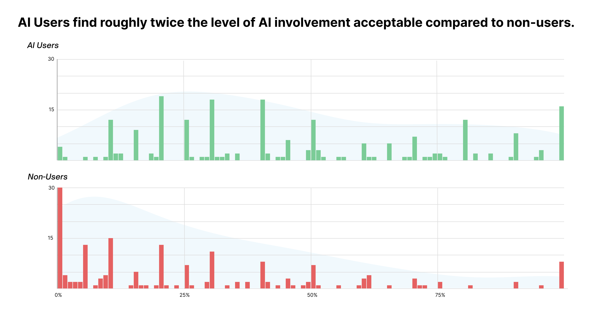
:::

Non-adopters's maximum threshold for AI generated content in a creative work cluster tightly at the lowest end of the scale, with more people choosing complete rejection (0%) than any other single value. From there, acceptance falls off steeply. @cr-q5two

:::{#cr-q5two}
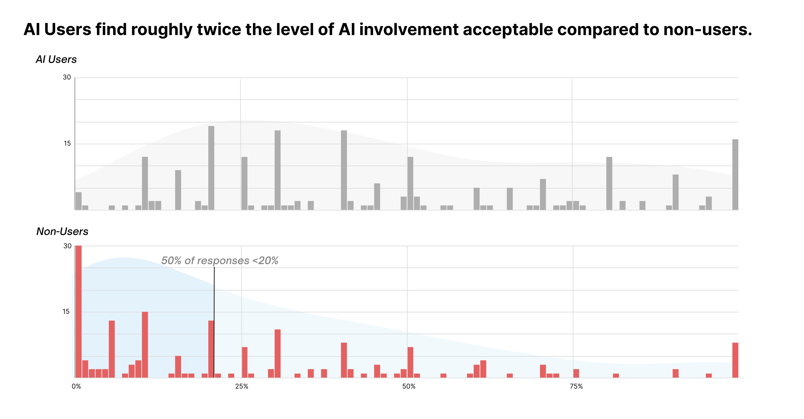
:::

A handful at the far end believe that even wholly generated pieces can be acceptable (100%), but the weight of the group sits firmly on the low end. @cr-q5three

**People who don't use AI, across the board, believe the acceptable amount of AI in art is very little to none at all.** @cr-q5three

:::{#cr-q5three}
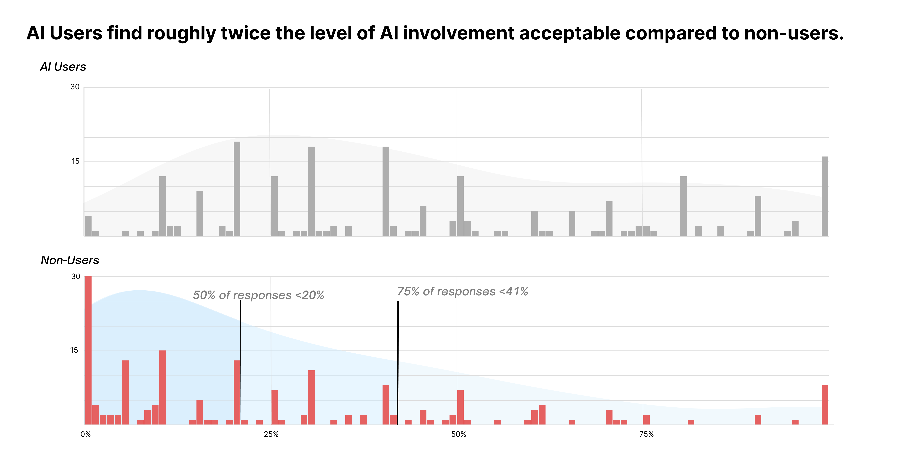
:::

Those who have used AI tell a different story. Their responses spread across the entire scale, notably deeper than non-users into the moderate range: willing to accept a substantial share of AI in a work, from more than a third to just about half. Others sit at or near full permissiveness (100%). @cr-q5four

:::{#cr-q5four}
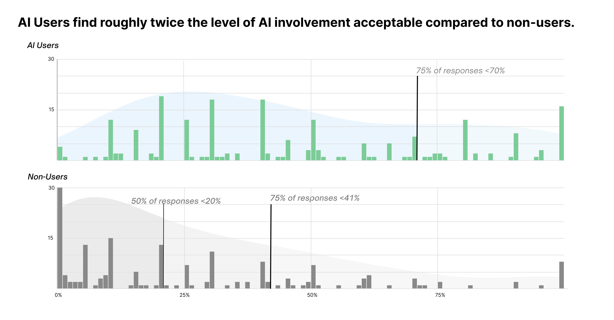
:::

Still others land closer to the non-adopter's position, setting the bar nearly as low. The adopter group contains its own internal disagreement about how far AI should go. And yet, even among AI users, the center of gravity falls below the halfway mark. @cr-q5five

:::{#cr-q5five}
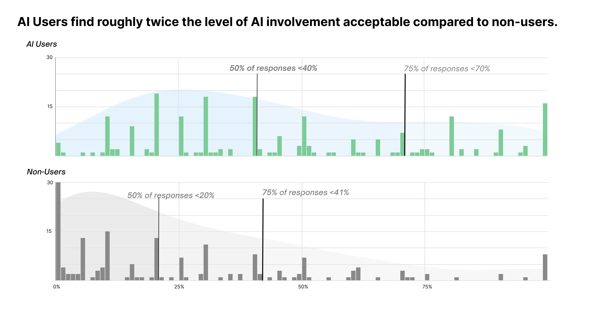
:::

Even those who have used these tools do not, on the whole, consider a majority-AI piece acceptable. They still draw the line before a work tips into being more 'generated' than 'made'. @cr-q5six

This contrasts the comparatively stricter views reported by non-adopters, though their different and overlapping spans are notable. @cr-q5six

This may reflect an ongoing internal negotiation where non-adopters have largely settled their position, while adopters are still working out the acceptable boundaries of AI in their own creative process. @cr-q5six

:::{#cr-q5six}
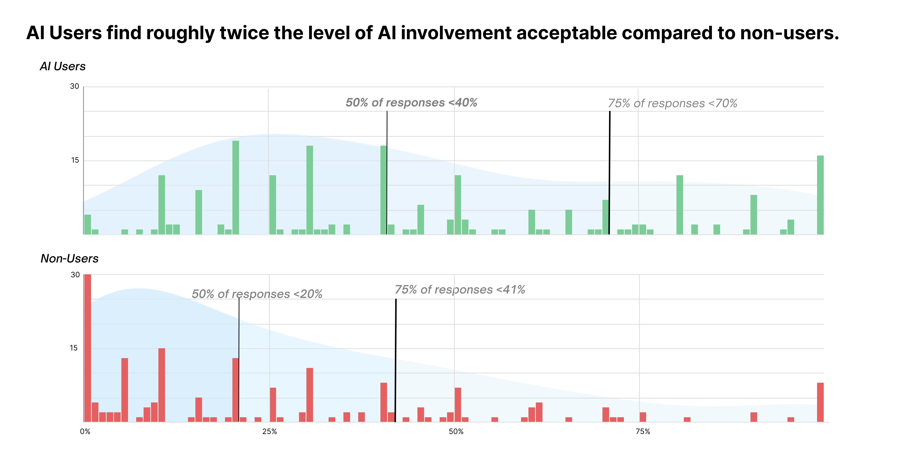
:::

:::

<!-- Close -->

<!-- HUMANMADE -->

:::{.cr-section}

**When the question shifts from acceptable AI use to human authorship (asking how much of a piece can be AI-generated while still being considered "human-made") both groups reveal a lower threshold still.** @cr-Q8one
 
:::{#cr-Q8one}
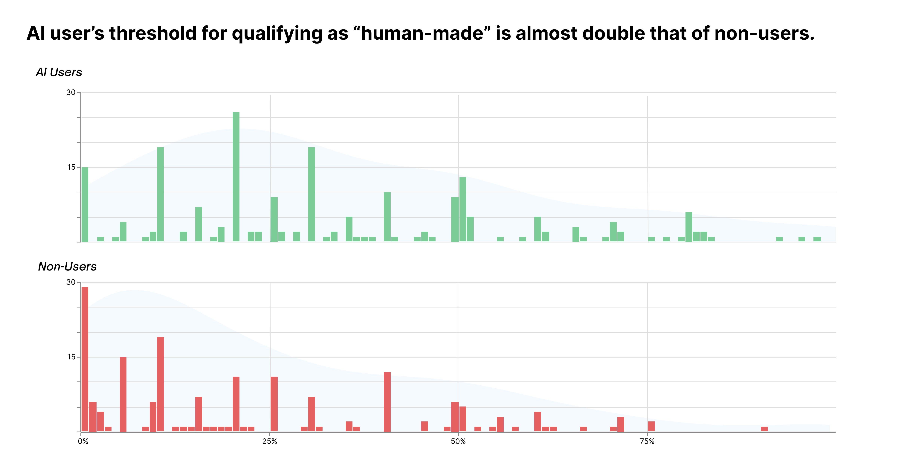
:::

Non-Users, as one might expect, become stricter on this measure of authorship. For half of non-AI users, anything beyond a minimal proportion of AI generation is enough to disqualify a work from being genuinely human-made (0-15%). Their position on human authorship is near absolute: a work is either overwhelmingly human-made, or it is not. @cr-Q8two

:::{#cr-Q8two}
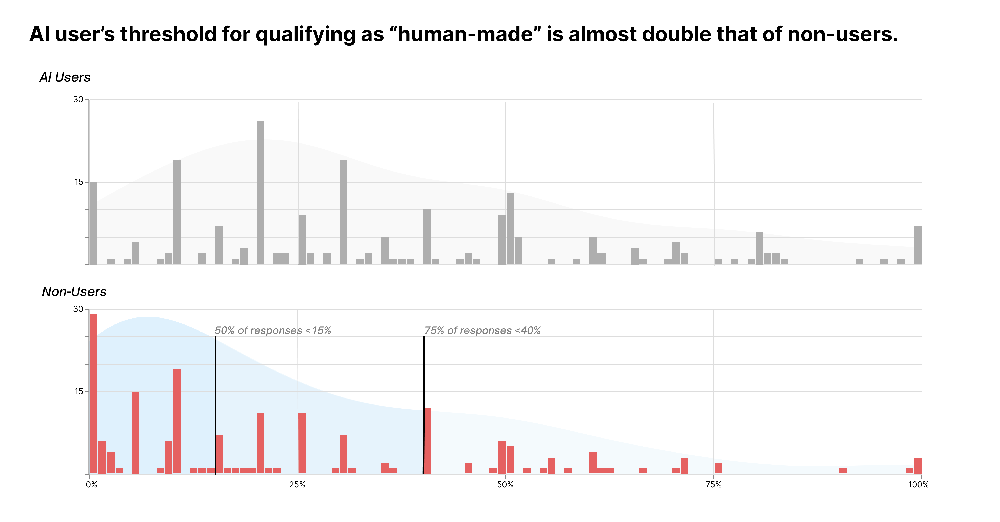
:::

AI Users, too, see a shift to the lower ends of the scale compared to their maximum acceptable thresholds. @cr-Q8three

Even among adopter, only the top quarter are willing to let AI generate more than half of a work and still call it human-made. @cr-Q8three

:::{#cr-Q8three}
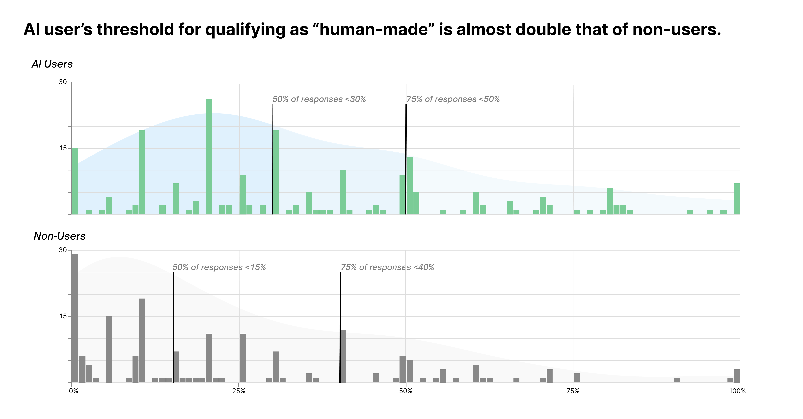
:::

Both groups hold a critical view of wholly AI-generated work, generally agreeing that such work should not be considered human-made, reflecting again a trend seen across the stages of production in a given medium. @cr-Q8four 

Where these groups disagree is over the size of the goldilocks zone: how much AI an acceptable and authentically ‘human’ work can contain. @cr-Q8four

Non-adopters place that threshold very low: a human-made work is one created almost entirely without AI. Adopters are more flexible, but still draw the line at or below the halfway point. @cr-Q8four

:::{#cr-Q8four}
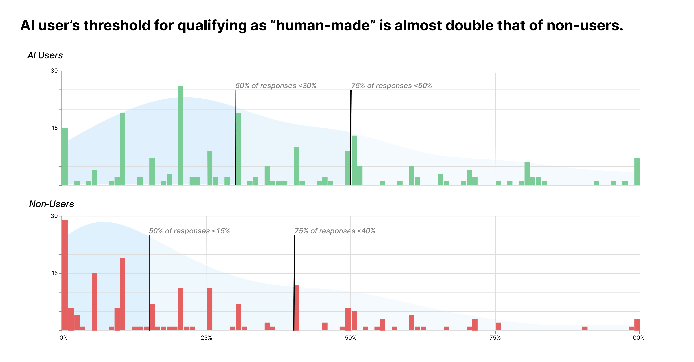
:::

:::

  <h2 class="section-header">Differences in Opinion... or lack thereof </h2>
  
Even though AI users are much more accepting of AI, it seems that the opinions of either group are not too different and of creators themselves.

<!--PERCEPTIONS OF VALUE AND QUALITY -->

:::{.cr-section}

**Whether AI use is acceptable in creative work is distinctly different from whether AI-generated work is of comparable value.** @cr-Q15

Non-adopters, who grant almost no AI into the human-made category, also reject the idea that AI art can match human art in quality. Three-quarters disagree, and nearly half feel this strongly. @cr-Q15

AI users, again, show a more conflicted response. A slim majority agrees AI art can be comparable. But more than two-fifths disagree — and a quarter of adopters disagree strongly. They are willing to call a work with substantial AI "human-made," yet many are not convinced that work holds up. @cr-Q15

The majority of non-users think AI art is not comparable in value to human art, and even among adopters, there's no consensus that it does. @cr-Q15

:::{#cr-Q15}
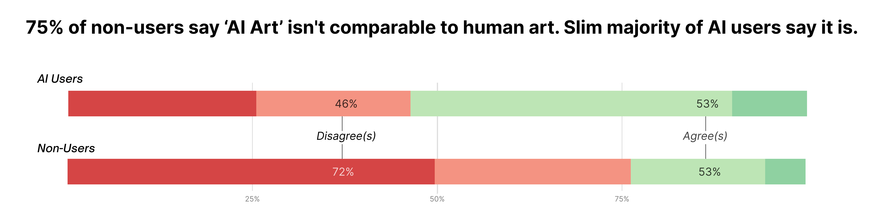
:::

:::
<!-- close -->

:::{.cr-section}

**Unlike other questions where AI users and non-users sharply diverged, on the question of whether AI has devalued human artistic skill, the two groups answered nearly identically.** Interestingly, both groups of respondents are a divided on this note. @cr-Q16

AI tools can generate in seconds what might take a skilled human hours or days. That ease inevitably changes how we value the labor behind an image, a text, or a piece of music. If a machine can do it, was the human effort ever worth that much?@cr-Q16

On the other hand, respondents have already indicated that very few consider whole-generation of a piece to be acceptable: meaning most of those using AI might see it as still requiring skill — just a different kind. Prompting, curating, editing, and integrating AI output into a coherent vision are not zero-skill activities.  @cr-Q16

We have not yet developed a cultural consensus on what counts as skill in the age of AI. The old definition — hand-executed technique, hours of practice, physical or cognitive labor applied directly to the medium — is under pressure. A new definition — taste, judgment, orchestration of tools — has not yet fully taken hold. The public is caught between them. @cr-Q16

:::{#cr-Q16}
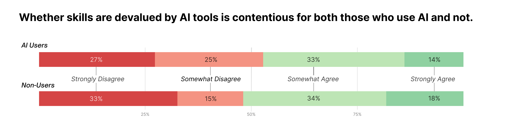
:::

:::

:::{.cr-section}

**Knowing AI was involved changes how people judge a work.** @cr-Q17

More than three-quarters of adopters say AI involvement impacts their interpretation of quality. Among non-adopters, the figure rises to nearly nine in ten. @cr-Q17

The difference between the groups is modest. Non-adopters feel it more strongly — half of them strongly agree, compared to roughly one-third of adopters — but the direction is the same. Both groups, on balance, acknowledge that the label "AI" shifts their perception of a work. @cr-Q17

This is one of several points in the survey where the adoption line does not produce opposing camps. Disclosure was another. @cr-Q17

What this question does not answer is the nature of that shift. Whether AI involvement functions as a penalty, a curiosity, or simply a different interpretive frame lies beyond the scope of what was asked. The data only establish that AI is not perceptually neutral. It alters evaluation for nearly everyone, regardless of their own relationship to the tools. @cr-Q17

:::{#cr-Q17}
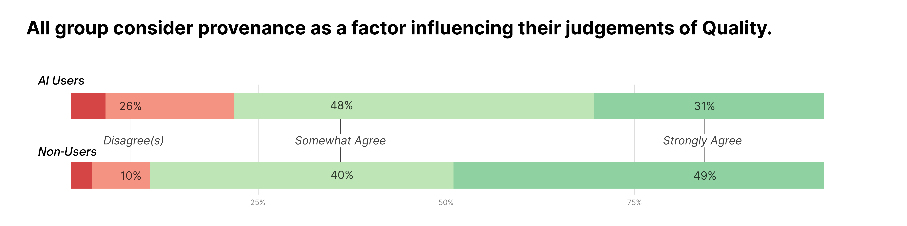
:::

:::

:::{.cr-section}

**Judgments influenced by AI extends to how one views the creator.** @cr-Q18

Among non-adopters, 79% view AI-using creators more negatively, with nearly a third reporting a much more negative view. Only 18% say AI use has no impact on their opinion. Positive views are negligible, totaling less than 3%. For non-adopters, the use of AI does not merely alter evaluation of the work — it diminishes the perceived standing of the creator. @cr-Q18

Among AI users, the pattern is more mixed. Nearly half report viewing AI-using creators more negatively, while 37.5% say it has no impact. Only 13% view them more positively. Even among those who have adopted AI tools themselves, negative views (49.6%) and neutral views (37.5%) are the two largest groups. Positive evaluation remains a minority position. @cr-Q18

Positive views of AI-using creators are essentially nonexistent among non-adopters and represent only a small fraction of adopters. The debate is not between positive and negative assessment, but between negative and neutral. @cr-Q18

One's own use of AI does not produce solidarity among AI creators. Adopters do not form an in-group that defends or celebrates its own. However, adopters are substantially less likely to judge other AI users negatively (49.6%) than non-adopters are to judge them (79%). What is certain is that the stigma attached to AI use persists even among those who engage in it, and positive views of AI-using creators are rare across both groups. @cr-Q18

:::{#cr-Q18}
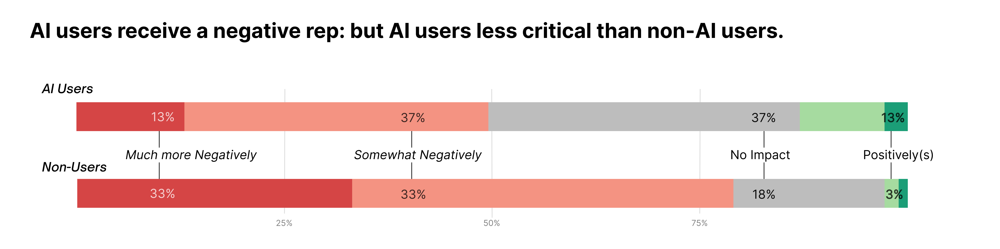
:::

:::

<!-- close -->

  <h2 class="section-header">Nobody's Doing Anything</h2>
  
For all the strong opinions, people are behaving largely the same as each other.

<!-- ACTIONS --> 

:::{.cr-section}

**AI Adopters and non-users experience the impacts of AI entirely differently.** @cr-q13

Among adopters, nearly half report a positive impact from AI's rise in creative spaces, with more than one in ten describing that impact as very positive. Only about a quarter report any negative impact, and very few describe it as severe. For those who have adopted AI tools, the technology has, improved their experience. They gained something. @cr-q13

Among non-adopters, the pattern reverses. Nearly half report a negative impact, with one in six describing it as very negative. Only about one in six report any positive impact. For those who have not adopted AI, the technology has worsened their experience. They lost something — or at least, they feel they have. @cr-q13

The largest single response among non-adopters is "unaffected" at 37%. This is noteworthy. A substantial portion of those who hold negative attitudes toward AI art, who judge AI-using creators negatively, and who set strict thresholds for acceptable AI use nevertheless report that their actual lived experience has not been impacted. The attitudes documented throughout this survey are, for a significant minority of non-adopters, running ahead of felt experience. @cr-q13

But 46.4% of non-adopters do report negative impact, and 16% report very negative impact. That is not a trivial share. For nearly half of non-adopters, AI has not merely changed opinions about art — it has altered the quality of their participation in creative spaces in a way they experience as personally costly. @cr-q13

The two groups are not symmetric. Adopters gained a tool and feel, that the trade has been favorable. Non-adopters gained nothing and indicate that the trade has been unfavorable. The debate over AI in creative work is not a clash of abstract principles: is a collision of material experience. @cr-q13

:::{#cr-q13}
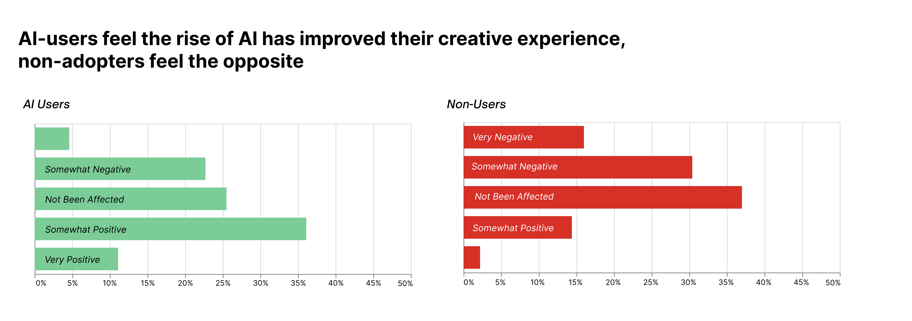
:::

:::

<!-- close -->

:::{.cr-section}

**Yet: avoidance of AI is widespread.** @cr-q14

Over 81% of respondents exercise at least situational avoidance of AI-generated content, with the majority indicating that context determines whether they engage. @cr-q14

This suggests that avoidance of AI isn't motivated by a particularly negative experience with AI outputs. @cr-q14

:::{#cr-q14}
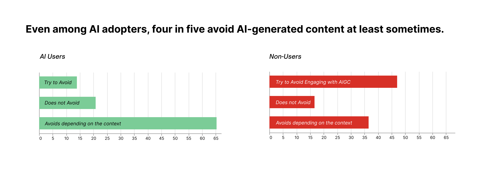
:::

:::

<!-- close -->

  <h1 class="ar-title">OPINIONS ON AI "ART"</h1>

  
 The survey reveals two distinct camps across many metrics. The new generation of people participating in creative work through use of generative tools are changing the creative community landscape. However, consensus has not yet been reached on what AI-generated artifacts are worth, what makes a work human-made, or even precisely how much AI is "too much".

  
  
However, Adopters report improved experiences, increased participation, while non-adopters report that it has worsened and decreased theirs.
 

  
 The clearest signal across the data is conditional acceptance: a willingness to engage with AI in creative work, but only within limits, and never without disclosure. This is even as reported experiences lean in either direction, with adopters reporting improved experiences and increased participation, and non-users the opposite. One might think these different lived realities shape everything downstream: from how strictly each group sets thresholds to how they regard the creators who use these tools. 

  
  
  
 However, people on opposite sides of the AI debate find common ground often than not, especially when exploring opinions outside the value of AI artifacts. For example, the low acceptance rates for core-generation indicates that, on some level, all respondents value a direct human hand in the creative process. That desires for required disclosure of AI use and avoidance of generated content are so widespread suggests there are shared core values opon which appropriate and widespread norms might arise 

  

  
 Adopters use generative tools, set looser thresholds, and report better experiences — yet even they hesitate. They admit that knowing AI was involved changes their judgment of a creative work. The stigma cuts across both groups. If the people actively using these tools aren't fully comfortable with them, then the debate is far from settled. The terms of acceptable use are still being negotiated, even by those most invested in the technology. As the creative industry adapts (whether by embracing or rejecting AI) these norms will eventually harden. For now: everything else remains unsettled.

<!-- ACTIONS TAKEN (lack thereof)

:::{.cr-section}

**.** @cr-Q22

When it comes to concrete action taken in response to AI-generated content in their spaces, 61.9% of respondents report having done nothing. @cr-Q22

Among those who have taken some action, the most common responses included adding watermarks, ceasing to share their works, or leaving communities — each reported at a rate lower than one in six respondents. @cr-Q22

Participation in online communities is similarly stable, with half of respondents reporting no change since the rise of AI. Among those who reported a shift, increases still outpaced the decreases. @cr-Q22

The gap between the attitudes of respondents towards AI and their actions taken indicates that while respondents have a somewhat coherent outlook on what makes or breaks the use of AI in a work, it has not translated into tangible action. @cr-Q22

The dominant response to AI-generated art, then, is to simply scroll past. @cr-Q22

:::{#cr-Q22}

:::

:::
<!-- close -->

<!--- yippie --> 